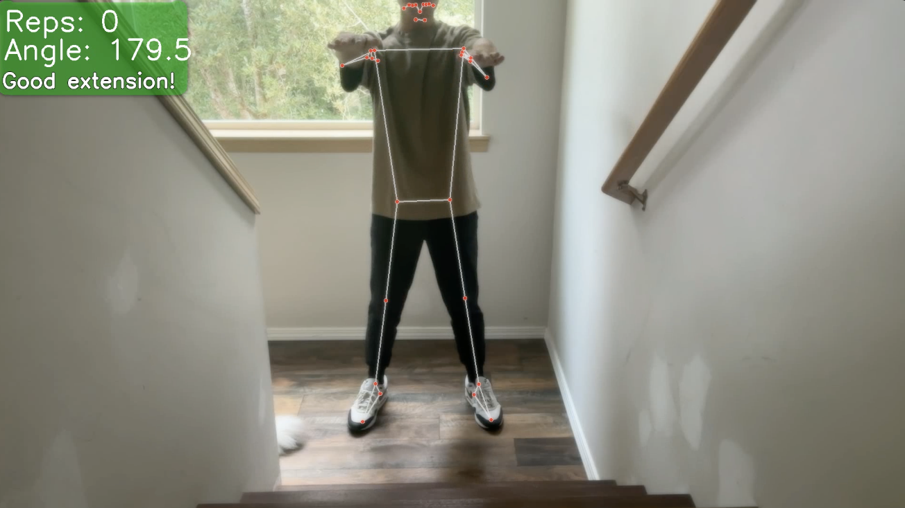

# Auto Squat Counter

This project uses Python, MediaPipe & OpenCV to count squats in real time.


# Watch My Demo
<p align="center">
  
</p>

(https://www.youtube.com/watch?v=ZPeSlNpS5mM)

## Quickstart
```bash
git clone https://github.com/yubin2005/AutoSquatCounter-main.git
cd AutoSquatCounter-main

python3 -m venv .venv
source .venv/bin/activate   # Windows: .venv\Scripts\activate
pip install -r requirements.txt

